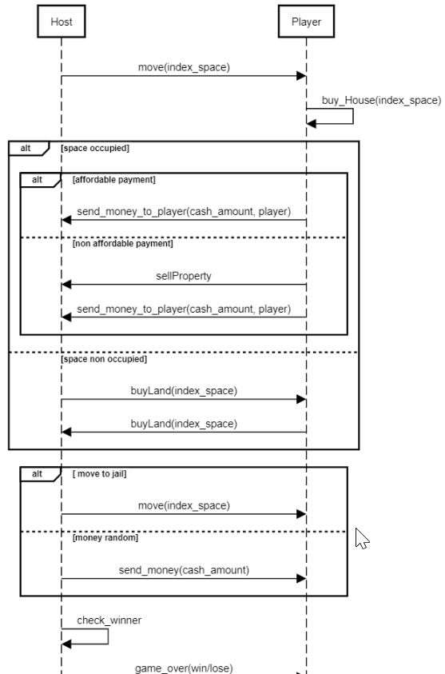

# Règles

Le jeu se joue à au moins deux joueurs et au maximum à six joueurs.

## Mise en place

Chaque joueur se voit attribuer un pion qui est placé sur la case "Départ" et commence la partie en recevant 1500€.  La partie se joue avec une paire de dés à six faces.

## Déroulé d'un tour
Chaque joueur lance les dés et avance son pion sur la case correspondante. En fonction de la case, il y a alors plusieurs possibilités :
Case libre : Le terrain/la gare/le service public n’appartient à personne. Le joueur peut, s'il le souhaite, en devenir propriétaire.

Case occupée:  Si le joueur tombe sur une case occupée, deux cas de figure se présentent :
Payer le loyer s'il a assez d'argent. 
Vendre un de ses biens à la banque s'il n'a pas assez d'argent pour payer le loyer.

Case appartenant au joueur : Le joueur tombe sur un terrain, une gare ou un service public qui lui appartient, rien ne se passe.

Case Aller en Prison : Le pion du joueur est placé sur la case Prison.

Case Chance : Le joueur obtient un malus (exemple : - 80) ou un bonus (exemple : + 80) décidé aléatoirement ou nouvelle postion.

Case Départ : Si le joueur passe ou s'arrête sur cette case, il obtient 200€ de la banque.

Gare : The four railroads/stations (Reading Railroad, Pennsylvania Railroad, B&O Railroad, and Short Line/Kings Cross, Marylebone, Fenchurch St, Liverpool St) are each worth 200. Rent is based on the number of railroads that player owns: 25 for one, 50 for two, 100 for three, and 200 for all four. Each railroad has a mortgage value of 100.

Case Prison : 
Attendre trois tours en lançant les dés à chaque tour pour essayer de faire un double. Si le joueur fait un double, il sort de prison en utilisant le lancer de dés pour avancer. Si, après les trois tours, il n'a pas fait de double, il doit payer 50€ à la banque et bouger son pion suivant son lancer de dés.
Payer une amende de 50€ au début du tour suivant. Le joueur peut alors lancer les dés et bouger son pion normalement.

À chaque tour, si le joueur possède tous les terrains d'une même couleur, il peut décider de construire des maisons sur ses terrains. Le joueur peut construire jusqu'à 4 maisons par terrain. 

Chaque maison ajoutée sur le terrain augmente sa valeur immobilière et donc le prix du loyer pour les autres joueurs. Le fait de construire une maison ne termine pas le tour du joueur.

Pour éviter les parties infinies ( aucun joueur n'arrive à avoir toutes les cases d'une couleur, donc pas de construction de maisons -> Loyer très faible), nous avons fait en sorte que si un joueur X a une case d'une couleur et que un autre joueur Y en a deux,  X vend forcément sa case 120% plus cher à Y.

## Fin de la partie

La partie s'arrête lorsque le dernier joueur est en situation de monopole, c'est-à -dire que tous les autres joueurs ont fait faillite.

# Détail des classes principales

* MonopolyHost classe exécutable représentant le maitre du jeu
* MonopolyToeGuest classe exécutable représentant l'adversaire du maitre du jeu
* MonopolyStandAlone jeu local.

# Protocole réseau

> Le protocole réseau définit les séquences des commandes échangées entre les différentes parties prenantes. Il doit contenir, pour chaque commande, l'expéditeur, le destinataire, le nom de la commande et le contenu du corps de la commande.

